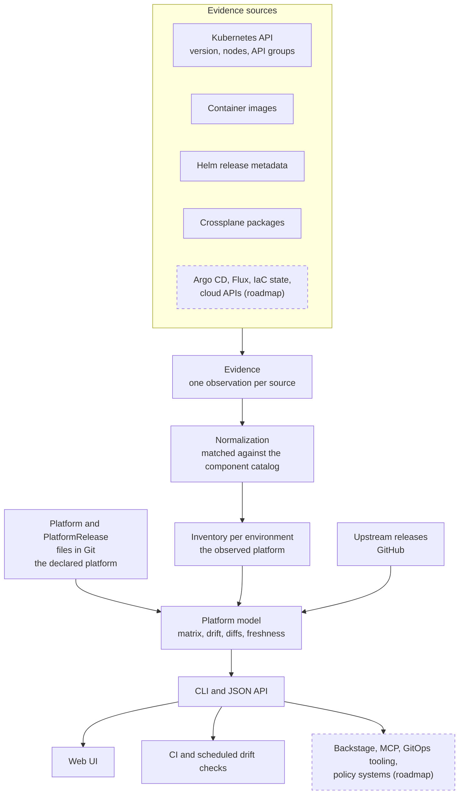

# Platform BOM

[](https://github.com/ravibagri5/platform-bom/actions/workflows/ci.yaml)
[](https://github.com/ravibagri5/platform-bom/actions/workflows/codeql.yaml)
[](https://github.com/ravibagri5/platform-bom/releases/latest)
[](go.mod)
[](https://golangci-lint.run/)
[](LICENSE)

**Know what your platform is made of.**

Platform BOM (`pbom`) is an open source platform inventory: a machine-readable,
continuously discovered description of an internal platform. It answers the
questions a platform team is asked every week and rarely has a reliable answer
to:

- What is our platform made of, and what does it provide to its users?
- Which versions are running in each environment?
- How does production differ from staging, and from what we said we would run?
- What has changed upstream, and which of it matters to us?

The core of the project is a **platform model**, not a user interface. Discovery
produces evidence, the evidence is normalised into an inventory, and the
inventory is compared with the platform you declared in Git. The CLI, the JSON
API and the web UI are all consumers of that model, and other tools can be too.

> **Project status.** Early development. `v0.1.0-rc.1` is the first release
> candidate. The resource schema is `v1alpha1` and will change. Everything
> described as *current* below is in this repository today; everything else is
> marked as roadmap.

## Contents

- [The problem](#the-problem)
- [Why existing tools are not enough](#why-existing-tools-are-not-enough)
- [Core concepts](#core-concepts)
- [PBOM: a Platform Bill of Materials](#pbom-a-platform-bill-of-materials)
- [How it works](#how-it-works)
- [Architecture](#architecture)
- [Example platform inventory](#example-platform-inventory)
- [Example PBOM](#example-pbom)
- [Declared vs observed platform](#declared-vs-observed-platform)
- [Upstream intelligence](#upstream-intelligence)
- [The UI](#the-ui)
- [Integrations](#integrations)
- [Community-maintained component definitions](#community-maintained-component-definitions)
- [Roadmap](#roadmap)
- [Principles and non-goals](#principles-and-non-goals)
- [Why this is different](#why-this-is-different)
- [Getting started](#getting-started)
- [Documentation](#documentation)
- [Contributing](#contributing)
- [Security](#security)
- [License](#license)

## The problem

An internal platform is a product. Application teams build on it, depend on its
guarantees and plan around its changes. Yet most platforms are described by a
wiki page, a spreadsheet of versions that was accurate once, and the collective
memory of the team that runs it.

A platform is also much more than Kubernetes. A typical one combines a cluster
distribution with GitOps (Argo CD, Flux), infrastructure composition
(Crossplane and its providers and functions, Terraform, Pulumi), node
provisioning (Karpenter), networking (Istio, ExternalDNS, cert-manager),
secrets (External Secrets), observability (Prometheus, Grafana, Thanos,
OpenTelemetry), policy (Kyverno), backup (Velero), managed cloud services and
the developer-facing offerings built on top of all of them. These components
are spread across repositories, installed by different mechanisms, and upgraded
at different times in different environments.

The result is a set of questions that are surprisingly hard to answer:

| Question | Typical answer today |
| --- | --- |
| What does our platform offer, and what is it built on? | A wiki page, if someone kept it current |
| Which version of the platform is production running? | "Mostly the same as staging" |
| What changed between platform 1.1 and 1.2? | Git archaeology across a dozen repositories |
| Is staging what we said it would be? | Nobody knows until something breaks |
| How far behind upstream are we, and does it matter? | A quarterly spreadsheet |
| Which offerings are affected if we upgrade this component? | Tribal knowledge |

## Why existing tools are not enough

Each of the tools platform teams already use answers a different question. None
of them treats the platform itself as the object being described.

| Tool | Answers | Platform BOM answers |
| --- | --- | --- |
| Kubernetes dashboard | *What resources are running in this cluster?* | *What is our platform, what does it provide, what is it made of, and which version of it are we operating?* |
| Developer portal, e.g. Backstage | *What software and services exist, and who owns them?* | *What is the platform those services run on made of?* |
| Cloud inventory, e.g. CloudQuery, Steampipe | *What cloud resources exist?* | *Which platform capabilities exist, and which technologies implement them?* |
| Version dashboard | *Which versions are installed?* | *What constitutes the platform, how is it versioned, how does it differ between environments, and what is changing?* |
| SBOM, e.g. CycloneDX, SPDX | *Which packages is this software artifact built from?* | *Which components and capabilities is this running platform built from?* |

Platform BOM is intended to sit above and between these systems as a platform
description layer. It reads from them as evidence sources and can feed them as
consumers; it does not try to replace them.

## Core concepts

```text
                      PLATFORM
                         │
         ┌───────────────┼───────────────┐
         │               │               │
     COMPONENTS      OFFERINGS       RELEASES
    what it is     what it provides  versioned snapshots
     made of                             │
         │               │               │
         └───────────────┼───────────────┘
                         │
                    ENVIRONMENTS
              where it runs, and what was
              observed running there
```

| Concept | What it is | Example |
| --- | --- | --- |
| **Platform** | The internal platform operated by a platform engineering team, described as a product: purpose, owners, guarantees, offerings and environments. | *Acme Internal Platform* |
| **Component** | A technology the platform is made of. Recognised during discovery through a catalog definition. | Kubernetes 1.34, Argo CD 3.1.5, Istio 1.27, Crossplane 2.0.2 |
| **Offering** | A capability the platform provides to its users, with a maturity status. It describes *what* is provided, not *how*. | GitOps deployment, Metrics, Secrets, PostgreSQL, Object storage |
| **Environment** | A place the platform runs, and the release it is expected to run. | `dev`, `staging`, `prod` targeting `1.2.0` |
| **Platform release** | A versioned snapshot of the platform: component versions and the offerings available. | Platform `1.2.0` |
| **Inventory** | What discovery actually found in one environment, with the evidence for every component. | `prod`: Argo CD 3.0.6, from the image of `Deployment/argocd-server` |

### Offerings are separate from implementations

An offering is defined by what users get, not by the technology behind it.
*Managed PostgreSQL* might be implemented with Crossplane and AWS RDS on one
platform, with Terraform and Azure Database for PostgreSQL on another, and with
Pulumi and Cloud SQL on a third. In Platform BOM the offering is the stable
name, and its `components` list records which technologies implement it on
*this* platform. Replacing the implementation changes that list, not the
offering users depend on.

Today, only components that can be observed through Kubernetes can be verified
by discovery. An offering implemented through Terraform or Pulumi can be
declared, but `pbom` has no evidence source for it yet (see
[M5](#roadmap)). Binding offerings to different implementations per
environment is also a roadmap item.

## PBOM: a Platform Bill of Materials

A **Software Bill of Materials (SBOM)** describes what a software artifact is
made of. It is an established practice with established specifications, notably
[CycloneDX](https://cyclonedx.org/) and [SPDX](https://spdx.dev/).

A **Platform Bill of Materials (PBOM)** applies the same idea one level up: a
machine-readable description of the components, capabilities, versions and
relationships that make up an internal platform, per release and per
environment.

| | SBOM | PBOM |
| --- | --- | --- |
| Describes | A software artifact | A running internal platform |
| Granularity | Packages and libraries | Platform components and offerings |
| Scope | One build | A release, and each environment it runs in |
| Captures drift | No, it describes one artifact | Yes, declared release vs observed environment |
| Status | Established, with CycloneDX and SPDX | **A term proposed by this project** |

To be explicit: PBOM is **not** an industry standard, has no industry adoption,
and is not endorsed by the CNCF or any other foundation. It is a concept this
project proposes and uses to structure its model. Where an established format
fits, Platform BOM should interoperate with it rather than compete; exporting a
platform release as a CycloneDX document is on the [roadmap](#roadmap), and a
PBOM can reference component SBOMs rather than duplicate them.

In the current implementation, a PBOM is expressed through three documents:

| Document | Role |
| --- | --- |
| `Platform` | The declared product: offerings, environments and their target releases |
| `PlatformRelease` | The declared bill of materials for one platform version |
| `Inventory` | The observed bill of materials for one environment, with evidence |

A single consolidated PBOM document is a roadmap item; see
[Example PBOM](#example-pbom).

## How it works



1. **Discovery** reads each environment. Today that means the Kubernetes API:
   the server version and nodes (to identify EKS, AKS, GKE, kind, k3s and
   RKE2), container images of Deployments, StatefulSets and DaemonSets, Helm
   release metadata, Crossplane Providers, Functions and Configurations, and
   served API groups, which include those of CRDs. Discovery only uses `get`
   and `list`.
2. **Evidence** is recorded per observation: where it came from, which object,
   and which version it reported.
3. **Normalization** matches evidence against the component catalog. Image
   patterns ignore registry and mirror prefixes, so a mirrored Argo CD image is
   still Argo CD. When sources disagree, the most trustworthy version wins:
   cluster version, then Crossplane package tag, then image tag, then Helm
   `appVersion`. Nothing is discarded: uncatalogued Crossplane packages and
   Helm releases are still reported and placed in the tree.
4. **The inventory** is the observed platform for one environment. It can be
   produced live or exported to a file, so clusters that the `pbom` server
   cannot reach can still be included.
5. **The platform model** compares inventories with the declared platform and
   its releases, and with upstream release data.
6. **Consumers** read the model through the CLI or the JSON API.

## Architecture

The UI is one consumer of the platform model. The model, the evidence, the
inventory and the interfaces to them are the product.

| Stage | Package | Current state |
| --- | --- | --- |
| Resource model | [internal/api](internal/api) | `Platform`, `PlatformRelease`, `Component`, `Inventory` |
| Discovery and evidence | [internal/discovery](internal/discovery) | Kubernetes evidence sources |
| Normalization | [internal/catalog](internal/catalog) | Builtin and user-supplied component definitions |
| Upstream data | [internal/upstream](internal/upstream) | GitHub releases, cached on disk |
| Analysis | [internal/analysis](internal/analysis) | Matrix, drift, freshness, recommendations |
| Releases | [internal/release](internal/release) | Load, create from an environment, diff |
| Interfaces | [internal/cli](internal/cli), [internal/server](internal/server) | CLI, JSON API, embedded web UI |

Architectural choices that matter for where the project goes:

- **Kubernetes is the first discovery environment, not the definition of a
  platform.** The resource model and analysis packages have no dependency on
  the Kubernetes client libraries; Kubernetes-specific code is confined to
  discovery. An environment can already be backed by an exported inventory file
  instead of a live cluster. Environment connection settings are still
  Kubernetes-shaped (`kubeContext`, `inCluster`), and generalising them is part
  of adding non-Kubernetes evidence sources.
- **Evidence sources are inputs, never the source of truth.** Crossplane,
  Helm, Terraform or Argo CD tell `pbom` that a component is present at some
  version. The platform, as declared by its team, is the abstraction.
- **Declared state lives in Git.** Platform and release definitions are plain
  YAML, reviewed in pull requests. `git log releases/` is the platform
  changelog.
- **Read-only by design.** `pbom` observes; it never writes to the systems it
  discovers.

## Example platform inventory

Illustrative output for the bundled [example platform](examples/acme), which
uses exported inventories so it runs without a cluster:

```text
$ pbom matrix

ENVIRONMENT  KUBERNETES  TARGET  RUNNING  STATUS
dev          1.34.1 eks  1.2.0   1.2.0    compliant
staging      1.34.1 eks  1.2.0   -        1 drift, 1 missing
prod         1.33.5 eks  1.1.0   1.1.0    compliant

CATEGORY        COMPONENT                  DEV       STAGING   PROD       RELEASE  LATEST
runtime         Kubernetes                 1.34.1 ✓  1.34.1 ✓  1.33.5 ✓ ↑ 1.34     1.37.0
delivery        Argo CD                    3.1.5 ✓   3.1.5 ✓   3.0.6 ✓ ↑  3.1.5    3.5.3
infrastructure  Crossplane                 2.0.2 ✓   2.0.2 ✓   2.0.0 ✓ ↑  2.0.2    2.4.2
infrastructure  Crossplane Provider Azure  2.0.0 ✓   - ✗       -          2.0.0    2.7.0
security        Kyverno                    1.15.1 ✓  1.15.0 ≠  1.14.2 ✓ ↑ 1.15.1   1.19.1
```

`TARGET` is the release an environment is expected to run; `RUNNING` is the
newest release it fully satisfies. Production targets `1.1.0` and satisfies it,
so it is compliant even though it is behind dev. Staging targets `1.2.0` but
runs a different Kyverno patch (`≠`) and lacks the Azure provider (`✗`), so it
satisfies no release.

## Example PBOM

### Current: a platform release

This is a `PlatformRelease` as it exists today, from the example platform:

```yaml
apiVersion: pbom.dev/v1alpha1
kind: PlatformRelease
metadata:
  name: "1.2.0"
spec:
  version: "1.2.0"
  date: "2026-09-15"
  summary: Azure infrastructure, Kubernetes 1.34 and composition functions.
  highlights:
    - Kubernetes upgraded to 1.34
    - Self-service Azure infrastructure alongside AWS
  components:
    kubernetes: "1.34"          # any 1.34.x
    argocd: "3.1.5"             # exactly 3.1.5
    crossplane: "2.0.2"
    provider-upjet-aws: "2.0.0"
    provider-upjet-azure: "2.0.0"
    istio: "1.27.1"
    prometheus-operator: "0.85.0"
  offerings: [kubernetes-workloads, ingress, metrics, postgresql, object-storage, gitops]
```

Offerings, and the components that implement them, are declared once in the
`Platform` document:

```yaml
offerings:
  - name: postgresql
    displayName: PostgreSQL
    category: data
    status: ga
    description: Request a managed PostgreSQL database with a Kubernetes claim.
    components: [crossplane, provider-upjet-aws]
  - name: gitops
    displayName: GitOps deployment
    category: developer-experience
    status: ga
    components: [argocd]
```

### Conceptual: a consolidated PBOM document

> **Conceptual.** The document below is not implemented and is not a stable
> schema. It illustrates the direction of
> [M3 and M11](#roadmap): one portable document combining the
> declared release, its offerings, and optionally the observed state of each
> environment with evidence.

```yaml
apiVersion: pbom.dev/v1alpha1
kind: PlatformBillOfMaterials
metadata:
  name: example-platform
  version: 1.8.0
components:
  - name: kubernetes
    version: "1.34"
  - name: argocd
    version: 3.5.5
  - name: istio
    version: "1.27"
  - name: prometheus
    version: "3.5"
  - name: grafana
    version: "12.1"
offerings:
  - name: gitops
    components: [argocd]
  - name: observability
    components: [prometheus, grafana]
observed:
  - environment: prod
    collectedAt: "2026-09-23T06:00:00Z"
    components:
      - name: argocd
        version: 3.4.4
        evidence:
          - source: image
            namespace: argocd
            object: Deployment/argocd-server
            version: v3.4.4
```

## Declared vs observed platform

The distinction between what a platform team *says* the platform contains and
what is *actually running* is central to the project.

- **Declared platform:** the `Platform` document, its `PlatformRelease`s, and
  the `targetRelease` of each environment. Written by the platform team and
  kept in Git.
- **Observed platform:** the `Inventory` of each environment, produced by
  discovery with evidence for every component.

Comparing them is implemented today. For each component in each environment:

| Status | Meaning |
| --- | --- |
| aligned | Declared in the target release and running at a matching version |
| drift | Declared, but running a different version |
| missing | Declared, but not found |
| untracked | Running with a known version, but not part of the target release: an undocumented component |
| present | Found, but either the environment has no target release or the version cannot be read |

For example, if release `1.8.0` declares Argo CD `3.5.5` and production is
observed running `3.4.4`, production reports drift for Argo CD and does not
satisfy `1.8.0`, whatever its `targetRelease` says. `pbom drift --exit-code`
turns this into a failing check for CI or a scheduled job.

A third view, what Git *intends* to deploy according to Argo CD or Flux, is on
the roadmap. It would allow a component to be shown as *declared 3.5.5, Git
3.5.5, running 3.4.4, OutOfSync*.

## Upstream intelligence

For every component with an upstream source, `pbom` compares the versions you
run with published releases and explains why a component may need attention.
It does not tell you to upgrade without a reason, and it does not use a model
to decide: the rules are deterministic and the evidence is shown.

```text
$ pbom updates --why

Kubernetes 1.33.5
  - Upstream supports the latest 3 minor releases; 1.33.5 is 4 minors behind 1.37.0 and out of upstream support.
  - 1.37.0 was released on 26 Aug 2026.
  - Low-risk step: patch 1.33.13 is available within your current line.
  - Environments run different versions: dev 1.34.1, prod 1.33.5, staging 1.34.1.
```

| Signal | Status |
| --- | --- |
| Latest upstream version, from GitHub releases | Current |
| Release dates and release notes between your version and the latest | Current |
| Patch, minor and major distance; upstream support window where declared | Current |
| Version skew between environments | Current |
| End-of-life dates, including managed Kubernetes support windows | Roadmap |
| Security advisories for running versions (GitHub Security Advisories, OSV) | Roadmap |
| Compatibility rules between components | Roadmap |
| Upgrade paths to a supported version | Roadmap |

## The UI

The web UI, served by `pbom serve`, presents the platform model as a product
rather than as cluster resources:

| View | Shows |
| --- | --- |
| **Platform** | The product page: purpose, current release, offerings, guarantees, where it runs, and the platform's own README |
| **Components** | What the platform is made of, grouped by category, with Crossplane providers and functions nested under Crossplane, and upstream update recommendations |
| **Offerings** | What the platform provides, the maturity of each offering, and the components behind it |
| **Releases** | Platform releases with notes, bill of materials and release-to-release diffs |
| **Environments** | Components × environments, with drift, versions and evidence |

It deliberately does **not** show pods, logs, events, ReplicaSets, ConfigMaps or
a generic resource browser. Those are implementation details, and existing
Kubernetes tools serve them well. The UI never changes anything; it rediscovers
on demand or on a schedule.

## Integrations

The platform inventory should be consumable from the tools platform engineers
already use. Integrations fall into two directions: **evidence sources** that
feed the inventory, and **consumers** that read from it.

### Current

| Interface | Direction | Notes |
| --- | --- | --- |
| Kubernetes API | Evidence | Cluster, workloads, Helm metadata, Crossplane packages, API groups |
| GitHub releases | Evidence | Upstream versions and release notes |
| CLI | Consumer | `discover`, `matrix`, `drift`, `updates`, `release`, `catalog` |
| JSON HTTP API | Consumer | Read-only, not yet versioned |
| Web UI | Consumer | Embedded in the binary |
| CI | Consumer | `pbom drift --exit-code` fails a job on drift |
| Kubernetes deployment | Distribution | A hardened kustomize base in [deploy/](deploy) |

### Roadmap

None of these exist yet. They are listed to show the intended shape of the
ecosystem, not as commitments.

| Integration | Direction | What it would do | Milestone |
| --- | --- | --- | --- |
| Argo CD, Flux | Evidence | Compare Git's intended state with the declared release and the observed version | M5 |
| Terraform / OpenTofu, Pulumi | Evidence | Recognise components and offerings implemented outside Kubernetes from state or stack outputs | M5 |
| AWS, Azure, GCP | Evidence | Correlate managed services with the offerings they implement, without becoming a cloud inventory | M6 |
| Backstage plugin | Consumer | Show the platform's offerings, releases and inventory inside a developer portal. Backstage is an integration, never a requirement. | M7 |
| Headlamp plugin | Consumer | A Platform view in Headlamp for the current cluster, read through the Kubernetes service proxy so the user's own RBAC applies | M7 |
| k9s plugin | Consumer | Shortcuts that run discovery, drift and update checks for the current context without leaving k9s | M7 |
| GitHub Action, GitLab CI component | Consumer | Drift checks with a Markdown job summary; release diffs on pull requests | M7 |
| Argo CD UI extension, Kargo | Consumer | Platform release status next to the applications and promotion stages that deliver it | M7 |
| Crossplane function or provider | Consumer | Let compositions use platform information, such as the declared release. Crossplane is one implementation technology among many, not the core of the model. | M8 |
| Kubernetes custom resources, Helm chart | Consumer, distribution | Platforms and releases as Kubernetes APIs; an alternative to the kustomize base | M8 |
| Prometheus metrics, kubectl plugin, Go client | Consumer | Alert on drift, run `kubectl pbom`, build on a typed client | M9 |
| MCP server | Consumer | Let AI assistants query the inventory through a standard interface, e.g. *"What version of Argo CD runs in production?"*, *"What changed between 1.7 and 1.8?"*, *"Which offerings depend on Crossplane?"*. The inventory stays the source of truth. | M10 |

## Community-maintained component definitions

Supporting a new technology should not require changing the core engine. This
already works: a component is one YAML file that says how to recognise it and
where its releases are published.

```yaml
apiVersion: pbom.dev/v1alpha1
kind: Component
metadata:
  name: argocd
spec:
  displayName: Argo CD
  category: delivery
  description: Declarative GitOps continuous delivery.
  homepage: https://argo-cd.readthedocs.io
  discovery:
    images: ["argoproj/argocd"]    # any registry or mirror prefix
    helmCharts: ["argo-cd"]
  upstream:
    github: argoproj/argo-cd
```

The builtin catalog in [internal/catalog/components](internal/catalog/components)
covers common CNCF and cloud native components. Platform teams can add or
override definitions with `componentsDir`, and contributing a definition
upstream teaches `pbom` about that technology for everyone. As more evidence
sources are added, the same file is where their signals will go.

## Roadmap

A direction, not a schedule. Milestones overlap and may change as we learn
from users. Each milestone below is a GitHub milestone with its issues, and
every issue is on the
[project board](https://github.com/users/ravibagri5/projects/2). Releases are
cut from `main` whenever enough has landed; see [ROADMAP.md](ROADMAP.md) for
what is next.

| Milestone | Status |
| --- | --- |
| [M0 — Project foundation](https://github.com/ravibagri5/platform-bom/milestone/1) | Done |
| [M1 — Kubernetes discovery](https://github.com/ravibagri5/platform-bom/milestone/5) | Done |
| [M2 — Platform inventory](https://github.com/ravibagri5/platform-bom/milestone/4) | Mostly done |
| [M3 — Platform releases and PBOM](https://github.com/ravibagri5/platform-bom/milestone/6) | In progress |
| [M4 — Upstream intelligence](https://github.com/ravibagri5/platform-bom/milestone/3) | In progress |
| [M5 — GitOps and IaC discovery](https://github.com/ravibagri5/platform-bom/milestone/2) | Planned |
| [M6 — Cloud evidence](https://github.com/ravibagri5/platform-bom/milestone/7) | Exploring |
| [M7 — Ecosystem integrations](https://github.com/ravibagri5/platform-bom/milestone/8) | Planned |
| [M8 — Kubernetes-native integrations](https://github.com/ravibagri5/platform-bom/milestone/9) | Exploring |
| [M9 — Developer interfaces](https://github.com/ravibagri5/platform-bom/milestone/10) | In progress |
| [M10 — MCP server](https://github.com/ravibagri5/platform-bom/milestone/11) | Planned |
| [M11 — PBOM specification](https://github.com/ravibagri5/platform-bom/milestone/12) | Exploring |

**M0 — Project foundation.** Repository and release tooling; the
resource model for platforms, components, offerings, environments and platform
releases; the JSON API. *Done.*

**M1 — Kubernetes discovery.** Cluster version and distribution;
components from container images, Helm releases, served API groups (including
CRDs) and Crossplane packages; an evidence record for every observation.
*Done.*

**M2 — Platform inventory.** Normalization through the component
catalog; per-environment inventories; environment comparison; drift; the
platform overview. *Done.* Remaining: inventory history and *what changed this
week*; an in-cluster agent that pushes inventories to a central server for
clusters it cannot reach.

**M3 — Platform releases and PBOM.** Declared platform, releases cut
from a live environment, release diffs and the newest release each environment
satisfies are *done*. Remaining: `pbom release lint`; CycloneDX export of a
release; binding offerings to implementations per environment.

**M4 — Upstream intelligence.** Upstream releases, release notes,
support windows and explainable recommendations are *done*. Remaining:
end-of-life data from [endoflife.date](https://endoflife.date) and managed
Kubernetes providers; security advisories; compatibility metadata between
components; upgrade paths.

**M5 — GitOps and IaC discovery.** Argo CD `Application` and Flux
`HelmRelease`/`Kustomization` evidence; Terraform/OpenTofu state and Pulumi
stacks; environments that are not only Kubernetes clusters. Helm is already
covered by M1.

**M6 — Cloud evidence.** AWS, Azure and GCP evidence, correlated with
the offerings they implement. Deliberately narrow: this is about recognising
platform capabilities, not listing every cloud resource.

**M7 — Ecosystem integrations.** Plugins for Backstage, Headlamp and k9s; a
GitHub Action and a GitLab CI component for drift checks; an Argo CD UI
extension and Kargo, if they prove worth maintaining.

**M8 — Kubernetes-native integrations.** A Crossplane composition function or
provider; platforms and releases as Kubernetes custom resources, with an
operator only if a controller is genuinely needed; a Helm chart.

**M9 — Developer interfaces.** The CLI and a read-only JSON API exist.
Remaining: a versioned REST API with an OpenAPI document, which the plugins and
the MCP server build on; Prometheus metrics; a kubectl plugin through krew; a
Go client; webhooks or events when drift or upstream state changes.

**M10 — MCP server.** A read-only MCP server exposing the inventory, over stdio
and HTTP: query component versions, offerings and releases, compare
environments and releases, and query upstream information.

**M11 — PBOM specification.** If the concept proves useful beyond this
project: a versioned PBOM schema with validation, examples, import and export,
publishing releases as OCI artifacts, and a community process for evolving it.

## Principles and non-goals

### Principles

- **The platform is the primary object.** Clusters, Helm, Crossplane, Terraform
  and cloud APIs are evidence that a component is present, not the model.
- **Evidence over assertion.** Every observed version can be traced to where it
  was seen.
- **Declared state is code.** Platform definitions and releases are files in
  Git, reviewed like any other change.
- **Read-only.** Discovery never writes to the systems it observes.
- **Explainable.** Recommendations state their reasons; there is no opaque
  score.
- **Implementation-agnostic offerings.** What the platform provides is modelled
  separately from how it is built.
- **Interoperate with established formats** such as CycloneDX instead of
  inventing parallel ones where they already fit.
- **The UI is a consumer.** Anything the UI shows must be available through the
  API.

### Non-goals

Platform BOM is not intended to become:

- another Kubernetes dashboard or resource browser;
- a generic cloud inventory;
- a replacement for Backstage or other developer portals;
- a deployment or promotion engine;
- a GitOps engine;
- an infrastructure-as-code engine;
- an observability platform.

Each of these can integrate with Platform BOM. It observes and describes the
platform they form; it does not deploy, upgrade or reconcile anything.

## Why this is different

- It describes **the platform**, not a cluster, a service catalog or a cloud
  account.
- It separates **what the platform provides** (offerings) from **what it is
  made of** (components) and **where it runs** (environments).
- It treats the platform as a **versioned product**, with releases, diffs and a
  changelog in Git.
- It compares the **declared** platform with the **observed** one, per
  environment, with evidence.
- It explains **why** a component needs attention instead of listing versions.
- It is a **model with interfaces**, so CI, portals, assistants and other tools
  can use the same answers as the UI.

## Getting started

You need Go 1.26+ and Node 24+ to build from source. No tagged release exists
yet.

**Try the example platform**, which needs no cluster:

```shell
git clone https://github.com/ravibagri5/platform-bom
cd platform-bom
make ui build
./bin/pbom serve -c examples/acme/pbom.yaml
```

Open <http://127.0.0.1:8080>.

**Discover a real cluster** with the builtin catalog only:

```shell
./bin/pbom discover --context my-cluster
```

**Try it on kind:** `make kind-demo` creates a kind cluster with Argo CD,
cert-manager and Crossplane; [examples/kind](examples/kind) describes it.

**Describe your own platform** and cut a first release from production:
[Describing your platform](docs/usage.md#describing-your-platform).

**Run it in a cluster** with the read-only kustomize base:
[Running in a cluster](docs/deployment.md#running-in-a-cluster).

Set `GITHUB_TOKEN` to avoid GitHub's anonymous rate limit for upstream checks,
or pass `--no-upstream` to work offline.

## Documentation

| Document | Contents |
| --- | --- |
| [docs/usage.md](docs/usage.md) | CLI, configuration reference, discovery, upstream updates, drift in CI, web UI, HTTP API |
| [docs/deployment.md](docs/deployment.md) | Installation, required RBAC, containers, running in a cluster |
| [ROADMAP.md](ROADMAP.md) | Near-term plans per release |
| [docs/community.md](docs/community.md) | Labels, planning and repository settings |
| [SECURITY.md](SECURITY.md) | Threat model and vulnerability reporting |

## Contributing

Contributions are welcome. The easiest place to start is the component catalog:
one YAML file teaches `pbom` about a new technology for everyone. Feedback on
the model, and on whether the PBOM concept holds up for your platform, is just
as valuable; open a discussion. See [CONTRIBUTING.md](CONTRIBUTING.md) for the
development setup. This project follows the
[CNCF Code of Conduct](CODE_OF_CONDUCT.md).

## Security

Please report vulnerabilities privately through
[GitHub security advisories](https://github.com/ravibagri5/platform-bom/security/advisories/new),
not public issues. See [SECURITY.md](SECURITY.md).

## License

Apache License 2.0. See [LICENSE](LICENSE) and [NOTICE](NOTICE).
