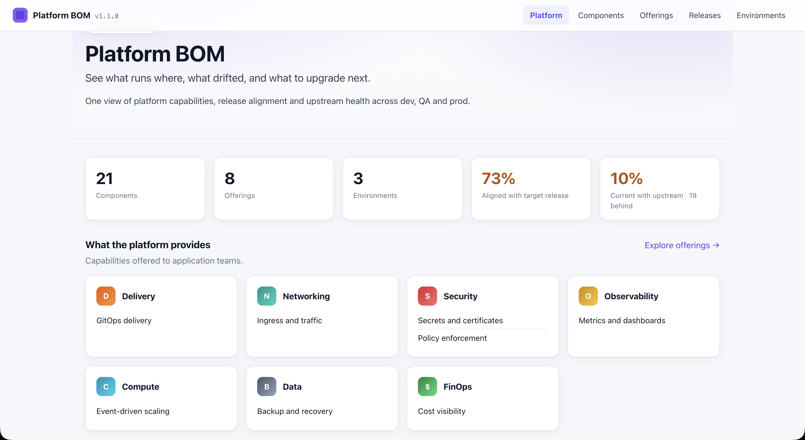
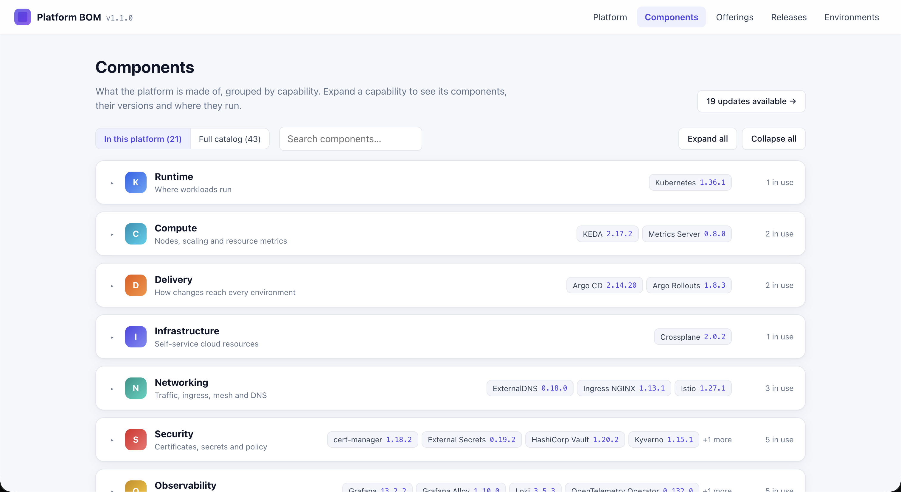
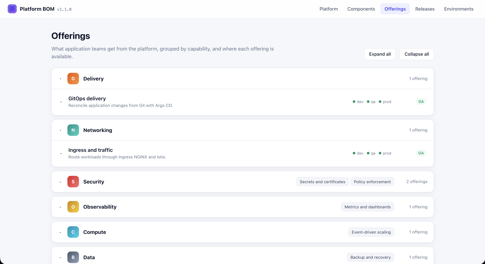
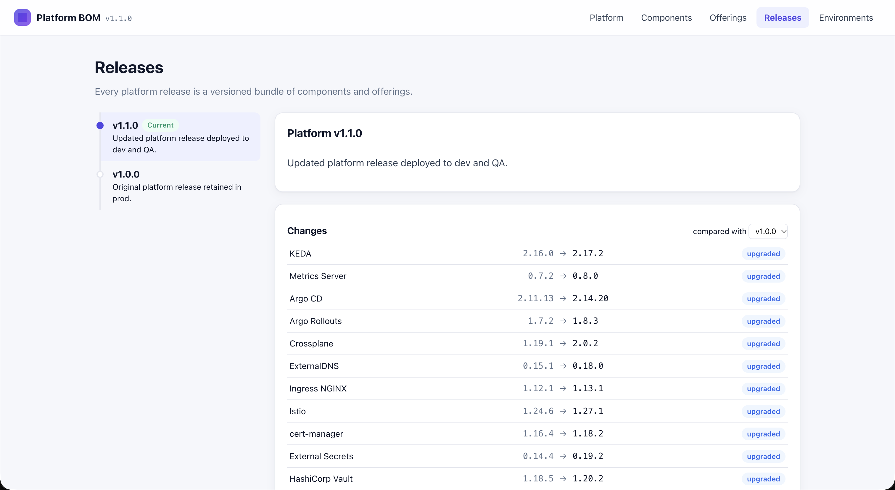
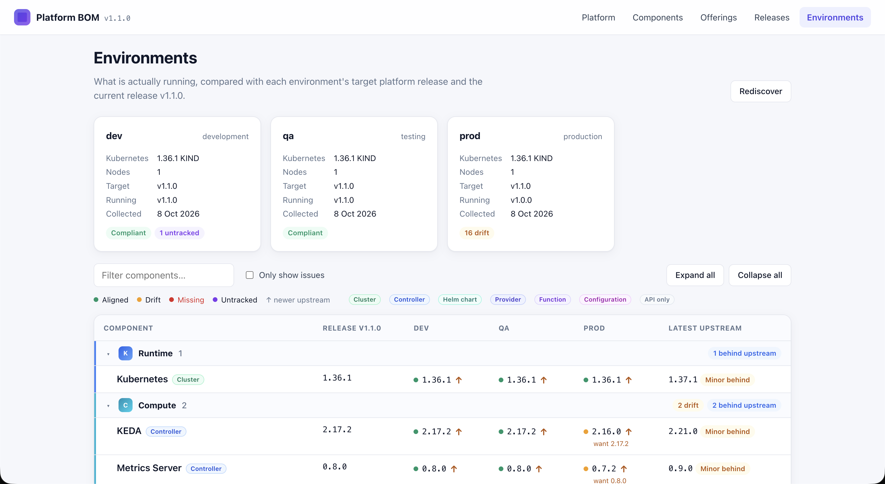
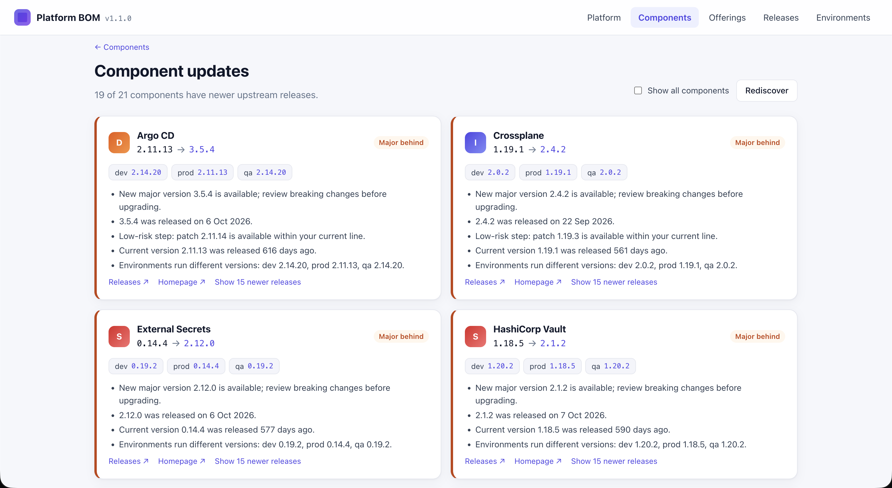

# Platform BOM

[](https://github.com/ravibagri5/platform-bom/actions/workflows/ci.yaml)
[](https://github.com/ravibagri5/platform-bom/releases/latest)
[](LICENSE)

**Know what your platform provides, what runs in each environment, and what needs attention.**

Platform BOM (`pbom`) is a read-only inventory for platform teams. It connects
your declared platform releases to evidence discovered from Kubernetes, Helm
and Crossplane, then compares versions across environments and with upstream.

- **Explain the platform:** Link capabilities offered to teams with the components behind them.
- **See release drift:** Compare what dev, QA and prod run with their target platform release.
- **Plan updates:** See upstream versions and why a component may need upgrading.

## See it in action

The [three-cluster kind simulation](examples/kind/simulation/README.md) shows
21 components and 8 offerings. Dev and QA match release `1.1.0`; prod still
runs `1.0.0` and has 16 component versions off target. Three components were
current with upstream when these screenshots were taken.

The feature screenshots use the same landscape viewport. Select an image to
see it at full size. A compact overview is also available [here](docs/screenshots/platform-compact.jpg).

**Platform:** A quick view of components, offerings, environment count, release
alignment, upstream currency, and the capabilities teams receive.

[](docs/screenshots/platform.png)

 [Compact platform overview](docs/screenshots/platform-compact.jpg)

| Screen | Purpose | Preview |
| --- | --- | --- |
| **Components** | Scan technology categories and observed versions; expand one for evidence and environment details. | [](docs/screenshots/components.png) |
| **Offerings** | See the capabilities teams receive; expand one for its implementing components and availability. | [](docs/screenshots/offerings.png) |
| **Releases** | Review the declared versioned platform snapshots and compare what changed between them. | [](docs/screenshots/releases.png) |
| **Environments** | Compare observed component versions with the Git-declared target release; pinpoint drift and untracked components. | [](docs/screenshots/environments.png) |
| **Updates** | Prioritize newer upstream releases with per-environment versions and reasons for attention. | [](docs/screenshots/updates.png) |

The simulation uses zero-replica discovery fixtures; it does not install or
operate the real products. Upstream releases and percentages can change over time.

## Deploy with GitOps

1. Fork and clone this repository. Set `inCluster: true` and `releasesDir: /releases` in `deploy/pbom.yaml`.
2. Commit and push. Point an Argo CD Application at your fork's [Kustomize base](deploy/) (`path: deploy`).
3. Run `kubectl -n platform-bom port-forward svc/pbom 8080:80` and open <http://127.0.0.1:8080>.
4. Review discovery, then commit a release and target version. GitOps syncs subsequent changes automatically.

[Follow the step-by-step GitOps guide](docs/gitops.md) for copyable YAML,
bootstrap commands, RBAC caveats and the first-release workflow.

## Try it locally

Go 1.26+, Node 24+, Docker, kind and Helm are needed for the kind simulation:

```sh
make kind-clusters
make kind-simulation
make ui build
./bin/pbom -c examples/kind/simulation/pbom.yaml serve
```

Open <http://127.0.0.1:8080>. Set `GITHUB_TOKEN` if you hit GitHub's API rate
limit; `--no-upstream` skips upstream checks. For a cluster-free example, run
`./bin/pbom serve -c examples/acme/pbom.yaml` instead.

## Documentation

| Guide | Contents |
| --- | --- |
| [Overview and concepts](docs/overview.md) | The problem, platform model, evidence, architecture, integrations, principles and roadmap |
| [Usage](docs/usage.md) | Configuration, discovery, CLI, drift checks, web UI and API |
| [Deployment](docs/deployment.md) | Installation, RBAC, containers and cluster deployment |
| [GitOps quick start](docs/gitops.md) | Fork, configure, sync with Argo CD, and cut a first release |
| [Kind simulation](examples/kind/simulation/README.md) | Recreate the screenshot environment and release drift |
| [Roadmap](ROADMAP.md) | Upcoming work and milestones |
| [Community](docs/community.md) | Planning, labels and participation |
| [Contributing](CONTRIBUTING.md) | Development and contribution guide |
| [Security](SECURITY.md) | Threat model and vulnerability reporting |

Platform BOM proposes a platform bill of materials; it is not an industry
standard. The resource schema is `v1alpha1` and may change. Licensed under
[Apache 2.0](LICENSE).
